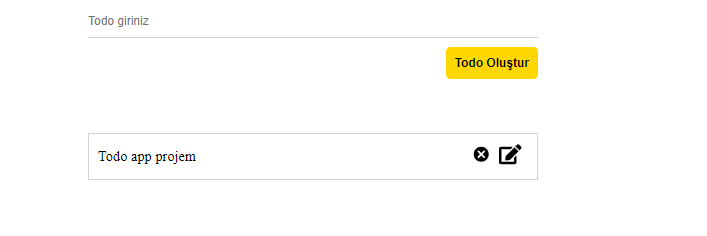

# Todo Uygulaması

Bu basit todo uygulaması, kullanıcıların yapılacaklar listesi oluşturmasına, düzenlemesine ve silebilmesine olanak tanır.

2. Proje dizinine gidin:

cd todo-app

3. Gerekli bağımlılıkları yükleyin:

npm install

4. Uygulamayı başlatın:

npm run dev

## Kullanım

- Yeni bir todo eklemek için, "Todo Oluştur" butonuna tıklayın ve metni girin. Enter tuşuna basarak veya butona tıklayarak yeni bir todo ekleyebilirsiniz.

- Var olan bir todo'yu silmek için, todo'nun sağındaki çöp kutusu ikonuna tıklayın.

- Var olan bir todo'yu düzenlemek için, todo'nun sağındaki düzenleme ikonuna tıklayın. Metni düzenledikten sonra onaylamak için onay ikonuna tıklayın.

## Ekran Görüntüsü
